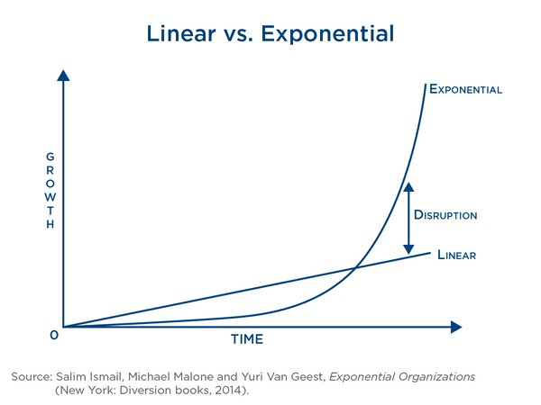

## Digital organization

### What is an exponential organization?

An exponential organization (ExO) uses innovative organizational strategies that take advantage of evolving technology to have an impact that is disproportionately large relative to that of its peers.

In general, the growth rate of these organizations is ten times faster than that of their competitors. All this is possible due to the fact that these business models use, in a strategic and efficient way, technological innovations based on market demand and needs.

---

First, let’s see the difference between an Exponential and a Linear Organization:

Do you see the difference? As the picture says, that is called disruption.

The main factor that contributes to the accelerated growth of exponential organizations is the ability to plan a service of total relevance to the consuming public, having technology as an ally in the structure and development of the business. With this, companies such as Netflix and Uber managed to achieve a great evolution of their brand by introducing new ways of offering common services based on agility, accessibility and low cost.

---

### Why?

An ExO is one that is ten times better, faster, and cheaper than the others, because it has technology as its primary asset. It’s based on technology and as technology evolves and becomes cheaper, so does the organization leveraging it.

---

Thank you for your attention
