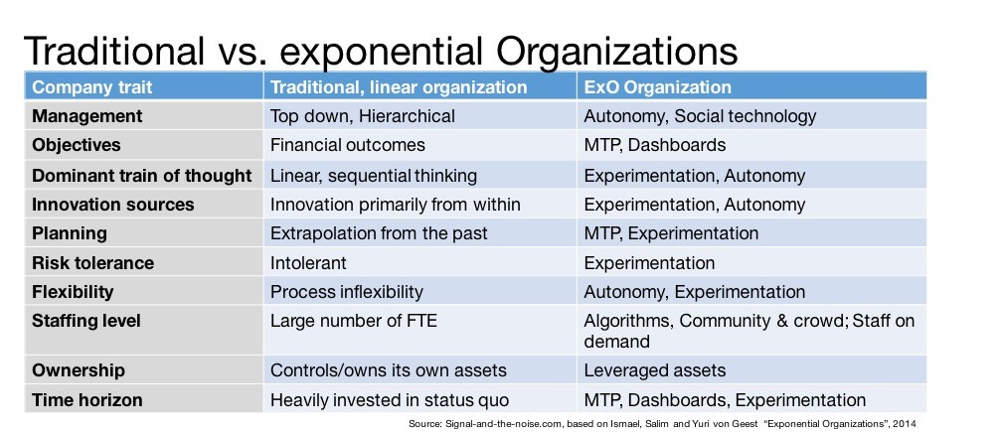
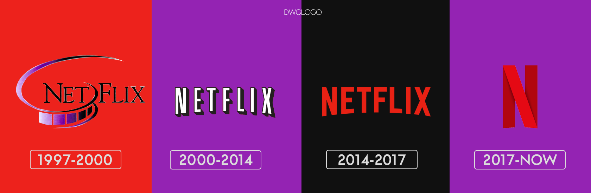
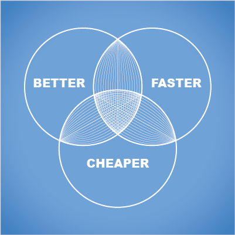
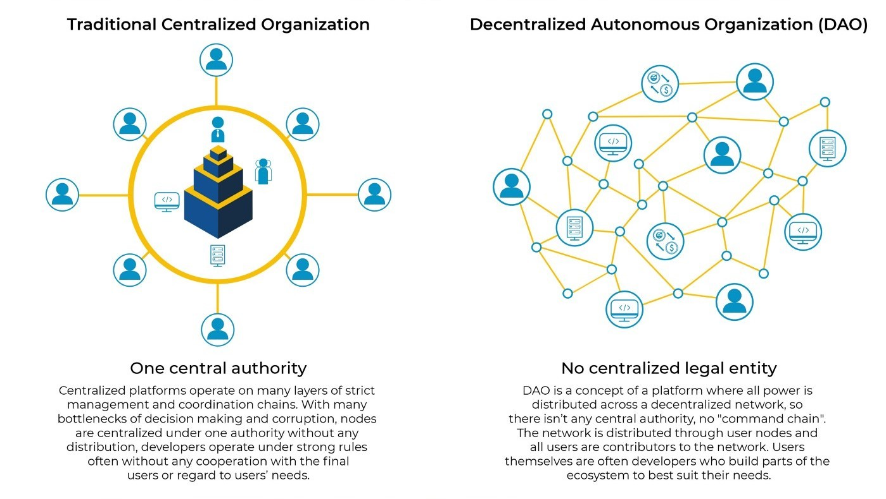

# Digital organization

---

## What is an exponential organization?

---

Agenda:

1.  Definition
2.  Linear and Exponential organization
3.  Why
4.  How
5.  Massive Trasportative Purpose
6.  Real life examples
7.  Conclusion

---

An **exponential organization** (ExO) uses innovative organizational strategies that take advantage of evolving technology to have an impact that is disproportionately large relative to that of its peers.

---

In general, the growth rate of these organizations is **ten times faster** than that of their competitors.

---

All this is possible due to the fact that these business models use, in a strategic and efficient way, **technological innovations** based on market demand and needs.

---

These organizations are able to **grow at an unprecedented rate** due to their ability to harness the power of emerging technologies such as artificial intelligence, the internet of things, and cloud computing.

---

### First, let’s see the difference between an Exponential and a Linear Organization

---

Do you see the difference? As the picture says, that is called disruption.

---

## Let's have a look on the others differences

---

The main factor that contributes to the accelerated growth of exponential organizations is the **ability to plan a service of total relevance to the consuming public**, having technology as an ally in the structure and development of the business.

---

With this, companies such as Netflix and Uber managed to achieve a great evolution of their brand by introducing new ways of offering common services based on agility, accessibility and low cost.

---

## Why?

---

An ExO is one that is ten times better, faster, and cheaper than the others, because it has technology as its primary asset.

---

It’s based on technology and as technology evolves and becomes cheaper, so does the organization leveraging it.

---

Exponential organizations have several characteristics that set them apart from traditional organizations.

---

|      Characteristics       |              Benefits               |
| :------------------------: | :---------------------------------: |
| Rely heavily on technology |     Scale rapidly at lower cost     |
|  Clear Purpose and vision  | Solve a pressing problem in society |
|      Highly adaptable      |    Not afraid to fail and learn     |

---

## How?

---

Exponential organizations are highly decentralized and distributed.

---

They use technology to **connect and collaborate** with people and resources all over the world, rather than relying on a centralized headquarters or physical location.

---

Said that, let's discuss about the **DNA of an Exponential Organisation**

---

Here is an overview of similarities that Exponential Organisations have built into their **DNA**:

---

· **Data**: Real-time dashboards and data are infused in everything they do.

· **Disruption**: They actively invest in new products and services that destroy their legacy revenue streams.

---

· **Open**: They move away from holding onto proprietary control of products and services and instead actively share their intellectual property within large communities.

· **Flat structure**: They have a high trust culture and they give autonomy to business units.

---

· **Small teams**: Their organisations consist of small teams that operate within a large vibrant ecosystem.

· **Rent not own**: They use staff on-demand and also leverage assets that they don’t own.

---

· **Don’t have a five-year plan**: They rather have a Massive Transformative Purpose (MTP) that guides the organisation and then they use real-time dashboards to make constant changes.

---

### But what is a MTP?

---

**MTP is best described by defining each of the three words**:

---

· **Massive**: Something audaciously big and aspirational.

· **Transformative**: Can cause significant transformation to an industry, community or to the planet.

· **Purpose**: There’s a clear “why” behind the work being done; something that unites and inspires action.

---

## 

---

The MTP acts as a company’s **“North Star”**, which directs all people and activity in the same direction.

---

Other advantages of having an MTP is that it helps direct a company’s innovation efforts, **attracts the best staff and a community of supporters** and will help to sell more products and services.

---

Examples of MTPs are:
| Benefits | Examples |
| :---------------: | :----------------: |
| Sustainable energy | Tesla |
| Sustainablle living | Uniliver |
| Organize world's info | Google |

---

These organizations have **several characteristics that set them apart** from traditional businesses, including a reliance on technology, a clear purpose and vision, open innovation and crowd sourcing, adaptability, and decentralization.

---

### When Exponential Organizations fail?

---

There are many classic reasons why ExOs fail, such as running out of money, scaling too quickly, or a significant competitor comes along.
Other reasons can be:

---

**Implementing in the wrong sequence.** For example, you cannot build a community without an MTP. Equally, you cannot apply lean start-up methods without an MTP and autonomy.

---

**Scaling on a weak foundation.** Scaling too fast is something that even big tech companies can be a victim of.

---

**Being acquired by a big corporation.** If you get acquired, you will enjoy financial success, but the new owner will likely not share your MTP and unwittingly destroy its value proposition.

---

### Let's think about some real world examples

**Each one of you can come up with Exponential Organization (or MTP) examples, who will have more will win!**

---

This exercise can open our eyes and show us how many companies are successfully using this model.

## Thank you for your attention
